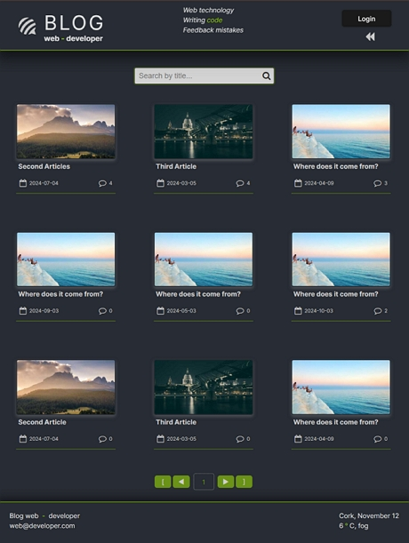
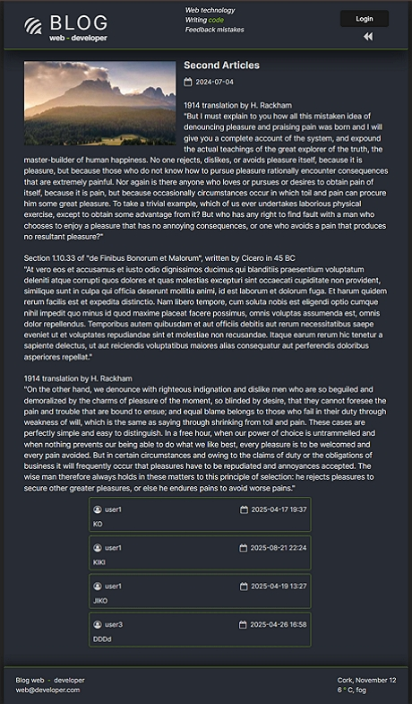
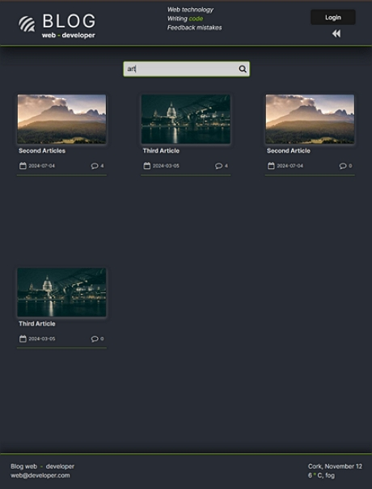
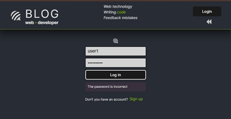
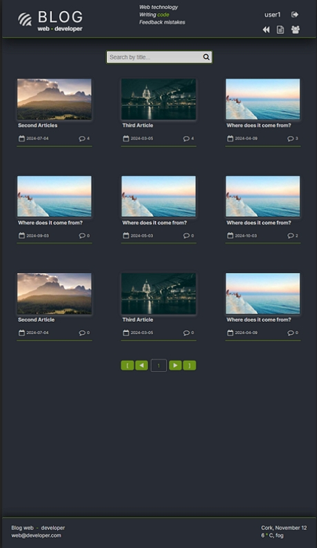
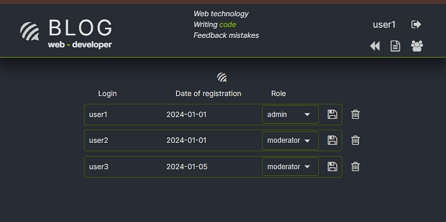
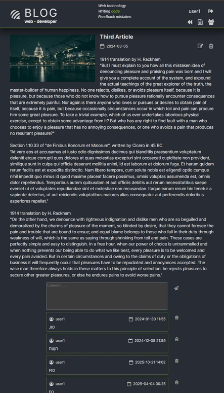
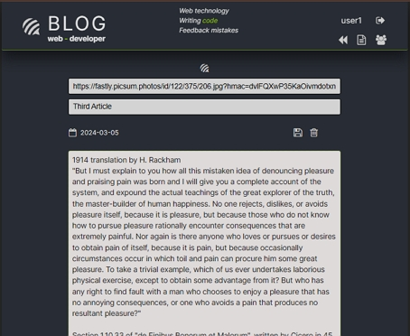
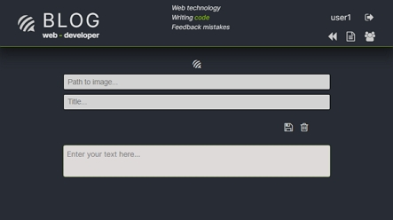

# React Module 1

## Project: Blog

### User Login Credentials 🔐

| Role          | Username | Password    |
|---------------|----------|-------------|
| **Admin**     | user1    | password123 |
| **Moderator** | user2    | password123 |
| **User**      | user3    | password123 |

### Project details: 🏠

Table BD:
1. users: id / login / password / registed_at / role_id
2. roles: id / name
3. post: id / user_id / published_at / title / image_url / content
4. comments: id / post_id / user_id / published_at / title / content

Schema for redux store:

1. user: id / login / role_id / session
2. posts-array:
    - post: id / user_id / published_at / title / image_url / content / commentsCount
    - comments-array:
        - id / author / content / publishedAt
    - users-array:
        - id / login / registeredAt / role

npm i
1. express
2. cookie-parser
3. mongoose
4. jsonwebtoken
5. bcrypt
6. validator
7. nodemon

#### [index page]

#### [index page permit all]

#### [search]

#### [password error]

#### [admin index]

#### [admin manager roles]

#### [admin post comments]

#### [admin post edit]

#### [admin post new]

