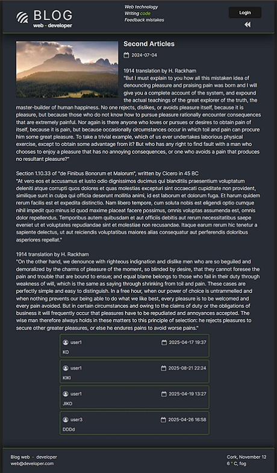
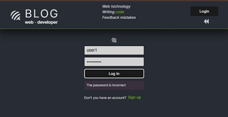
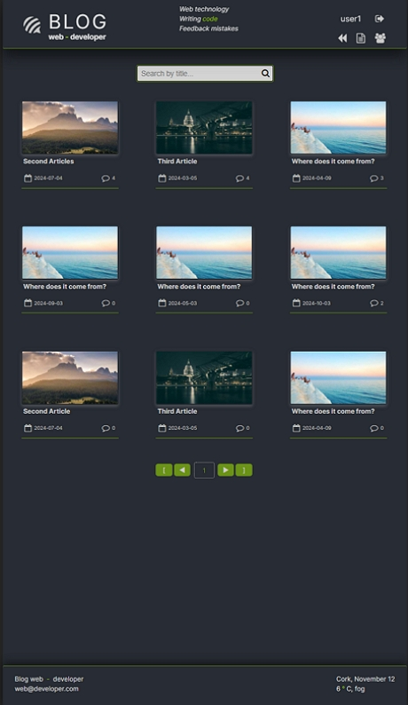
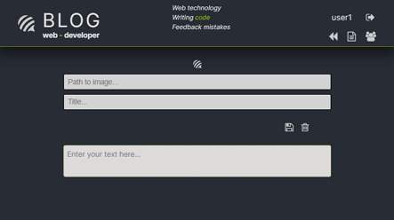

# React Module 1

## Project: Blog

### User Login Credentials 🔐

| Role          | Username | Password    |
|---------------|----------|-------------|
| **Admin**     | user1    | password123 |
| **Moderator** | user2    | password123 |
| **Reader**    | user3    | password123 |

### Project details: 🏠

npm i -g json-server
npm i
styled-components
prop-types
react-hook-form yup
react-router
redux redux-thunk react-redux
npm i @hookform/resolvers

region for keep data:
bd json-server
BFF
redux store

Entity app:
user: bd-users list, BFF session, store
role user: bd-list of roles, BFF session user with role, store
article: bd-list of article,store
comment: bd-list of comments, store

Table BD:

1. users: id / login / password / registed_at / role_id
2. roles: id / name
3. post: id / user_id / published_at / title / image_url / content
4. comments: id / post_id / user_id / published_at / title / content

State BFF:

1. session user: login / password / role

Schema for redux store:

1. user: id / login / role_id / session
2. posts-array:
	- post: id / user_id / published_at / title / image_url / content / commentsCount
	- comments-array:
		- id / author / content / publishedAt
	- users-array:
		- id / login / registeredAt / role

#### [index page]

#### [index page permit all]

#### [search]

#### [password error]

#### [admin index]

#### [admin manager roles]

#### [admin post comments]

#### [admin post edit]

#### [admin post new]

