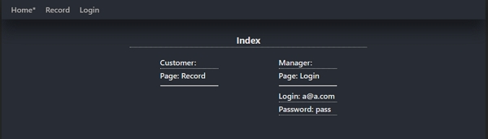
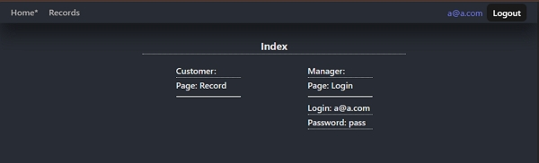
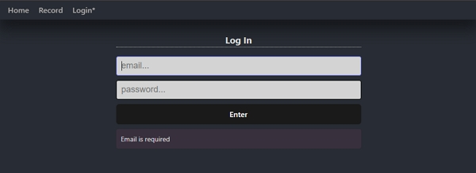
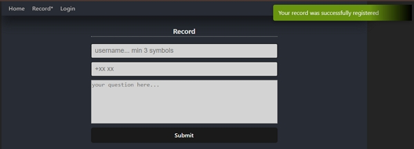
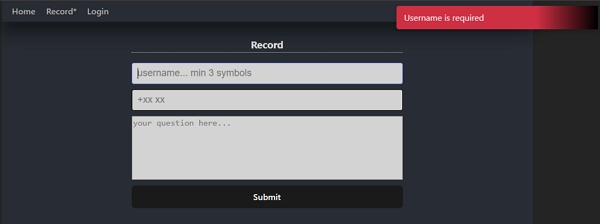
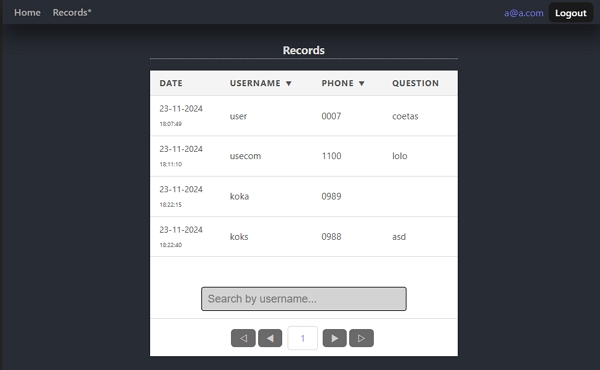
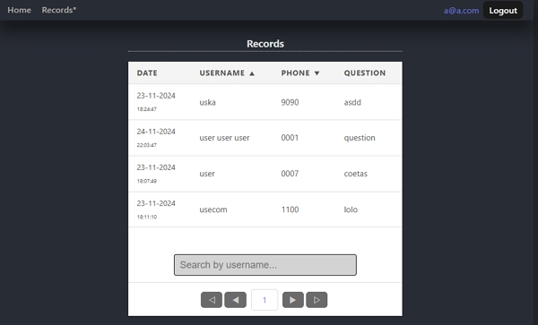
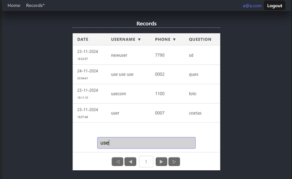
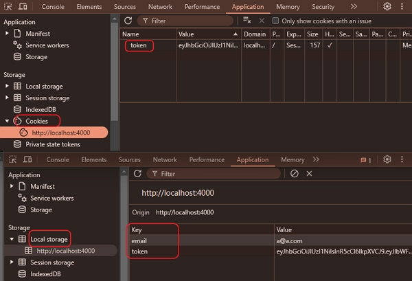

#### BACKEND

##### Authentication Records

************************************************

#### IMPORTANT:  

1. for starting you need have the mongodb already running. 
change credentials to yours in file backend/index.js. 
2. a credential for login in home page: login/password
************************************************
npm i:

1. validator
2. bcrypt
3. jsonwebtoken cookie-parser
4. outdated
5. types/validator

#### [ Page Index No Token ]

#### [ Page Index Token ]

#### [ Page Login ]

#### [ Page Record Success]

#### [ Page Records Fail]

#### [ Page Records Fail]

#### [ Page Records Authenticated]

#### [ Page Records Sort]

#### [ Page Records Search]

#### [ Token]

