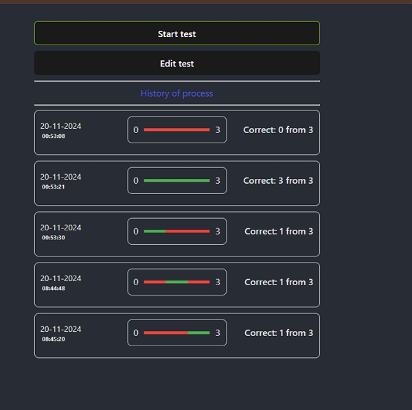
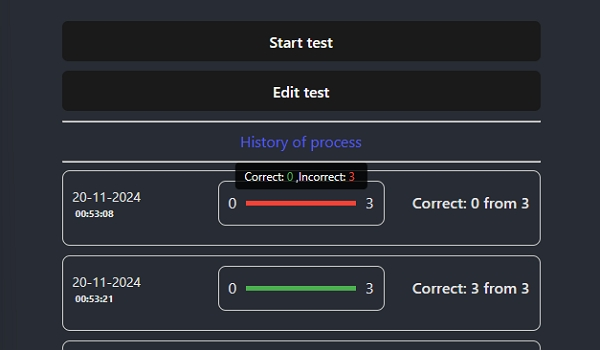
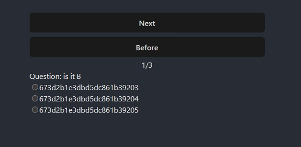
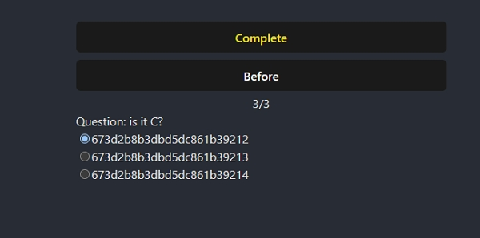
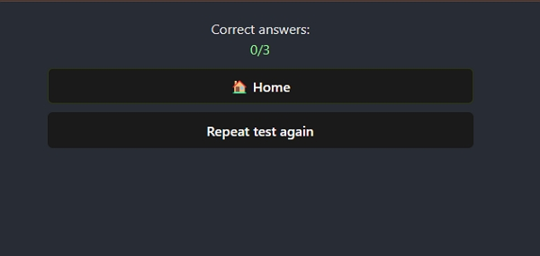
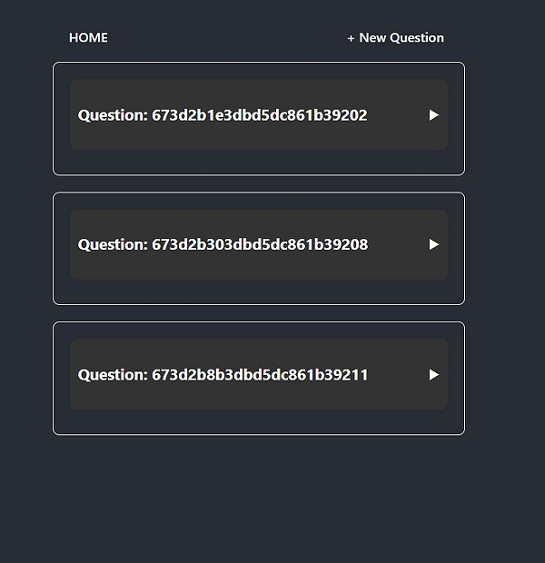
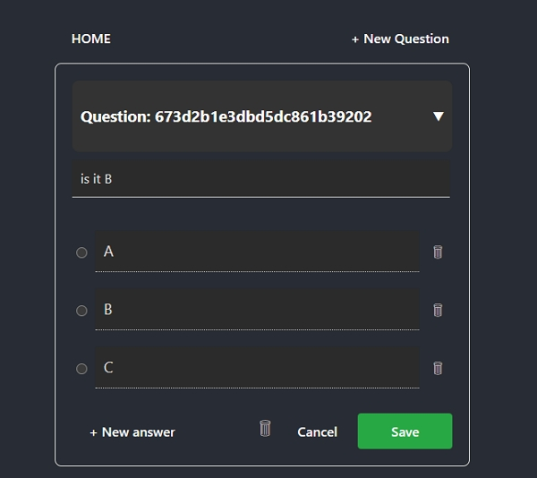
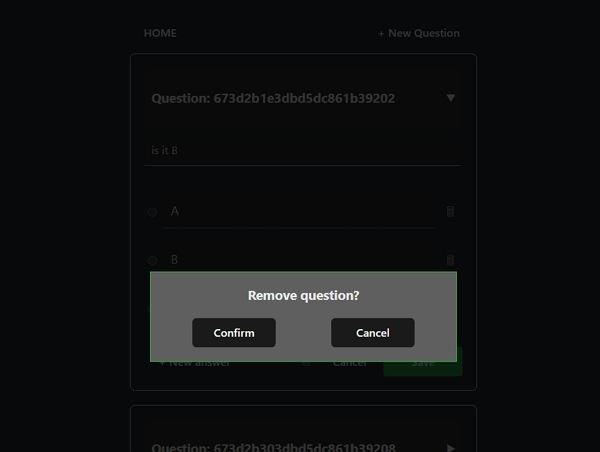
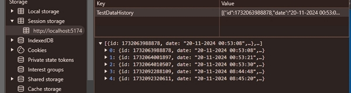

# Node Module 1

## Project: Quiz

redux:
test : id, question, answer, options
app: modal: isOpen, onConfirm,onCancel

mongodb entity:
test: id, question, answer, options

1. npm i redux redux-logger redux-thunk react-redux
2. npm i styled-components
3. npm i prop-types
4. npm i react-router-dom
5. npm i prop-types
6. npm i cors
7. npm install --save-dev eslint @eslint/js globals

#### [ Page index ]

#### [ Tooltip ]

#### [ Page answers ]

#### [ Page complete ]

#### [ Page result ]

#### [ Question components ]

#### [ Question component ]

#### [ Modal delete ]

#### [ Session storage ]

