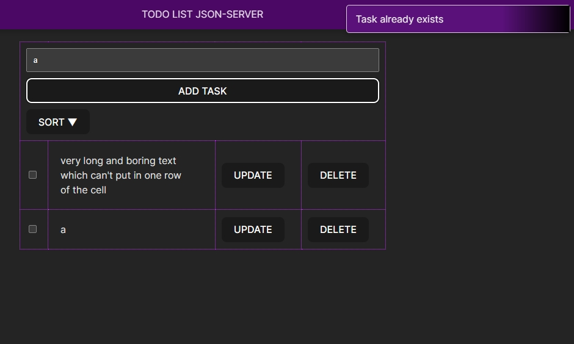

## Модуль 1: React

#### useEffect and firebase

1. 🔑 set db credential in firebase-config.jsx
2. 📥 get db in firebase-config.jsx
3. 🚀 start run build ->folder dist
4. ⚙️ firebase init -> public folder dist
5. 🌍 firebase deploy 6.
6. 🔗 firebase.com https://todo-a7650.web.app/

