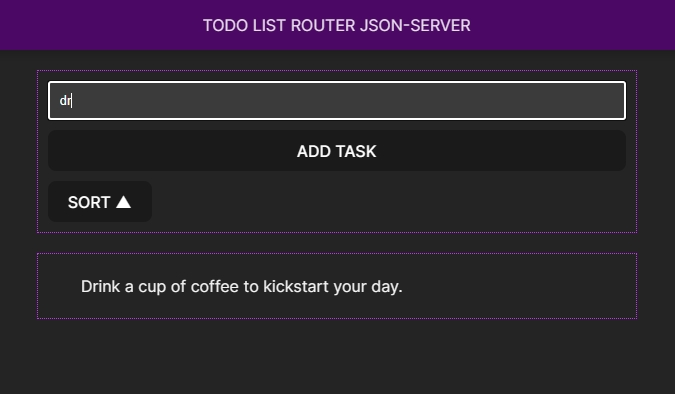
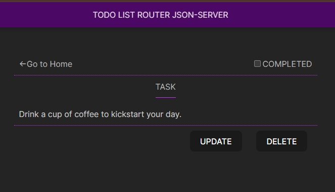
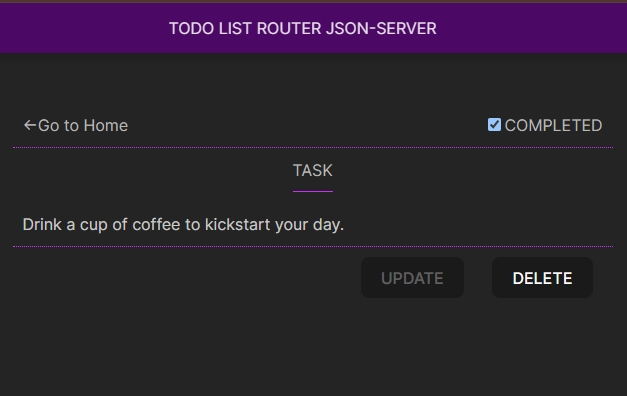
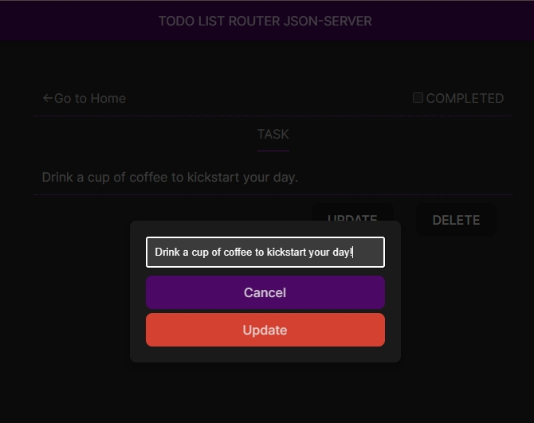
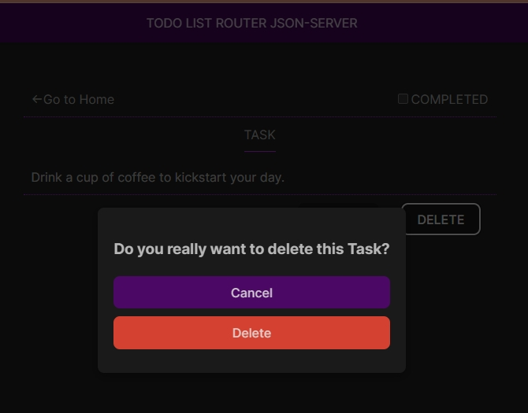

## Модуль 1: React

### Route

#### Video:  https://goo.su/7Yono

#### Navigation

1. 🌐 Link
2. 🌐 Outlet

#### Hooks React Router

1. 🧭 useParams
2. 🧭 useNavigate

#### Hooks React

1. 🔄 useEffect
2. 🔄 useState

#### Routing

1. ❌ \404

#### Json-server

1. 🖥 json-server --watch src/assets/db.json --port 5000
2. 📦 npm install -g json-server@0.17.4

### EsLint
npm install
eslint @eslint/js
eslint-plugin-react eslint-plugin-react-hooks
eslint-plugin-react-refresh globals --save-dev

npm install vite-plugin-eslint --save-dev

