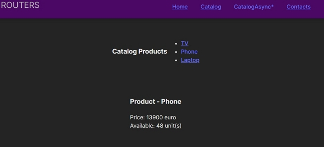
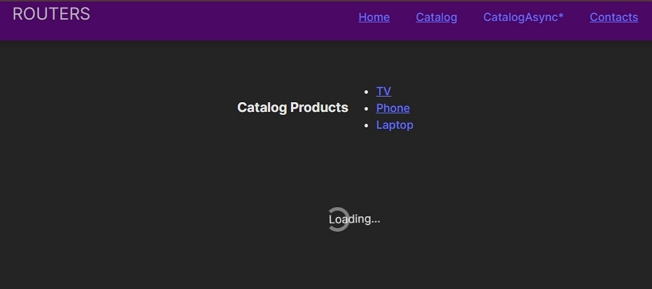

## Модуль 1: React

### Route

#### Navigation
1. 🌐 Link
2. 🌐 NavLink
3. 🌐 ExtendedLink
4. 🌐 Outlet
#### Hooks React Router
1. 🧭 useParams
2. 🧭 useNavigate
#### Hooks React
1. 🔄 useEffect
2. 🔄 useState
#### Routing
1. ❌ \404
2. 🛣 useRoutes

