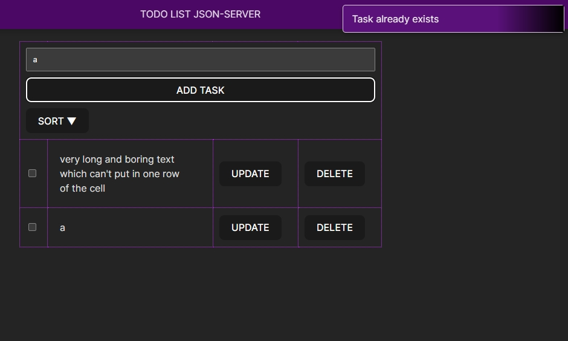

## Модуль 1: React

#### Redux Thunk and local db and json-server

1. 📦 npm install -g json-server@0.17.4
2. 🖥 json-server --watch src/assets/db.json --port 5000
3. 📂 db.json
4. ⚙️ Thunk
5. 📝 Action
6. 🔗 applyMiddleware
7. 🔀 combineReducers

