# React Module 2 SSR React: db Prisma

## Project: Events

#### [home page]

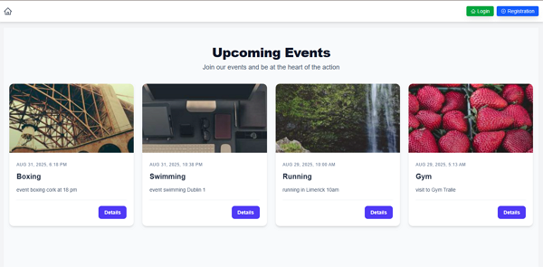

#### [details page]

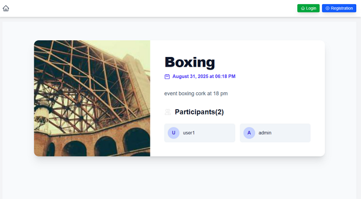

#### [register page]

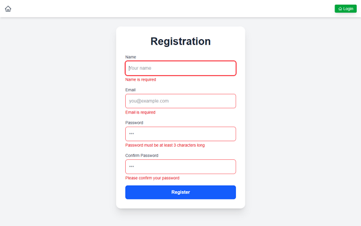

#### [login page]

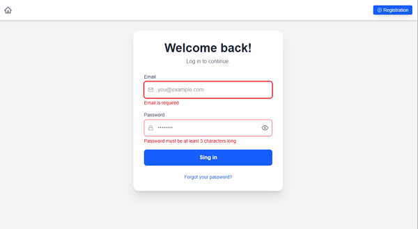

#### [admin home page]

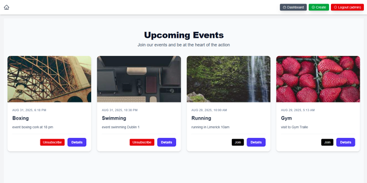

#### [admin details page]

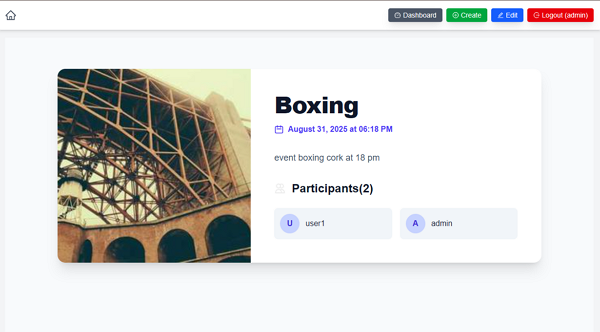

#### [admin create page]

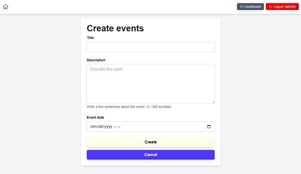

#### [admin edite page]

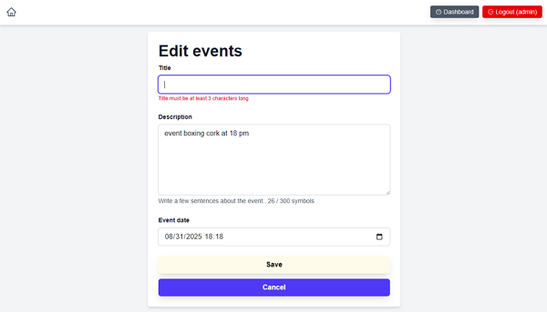

#### [admin dashboard page]

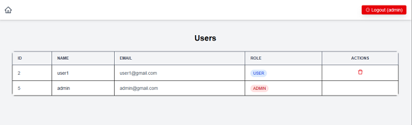

#### [admin delete modal]

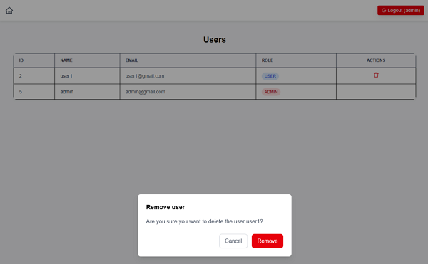

#### [user home page]

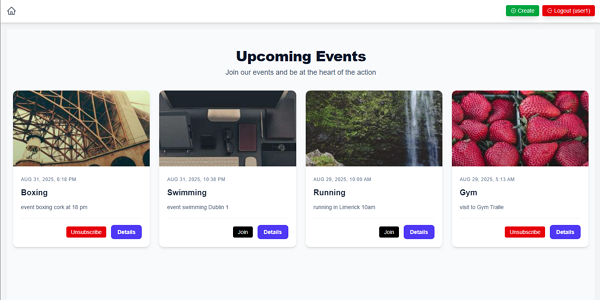

#### [user edit page]

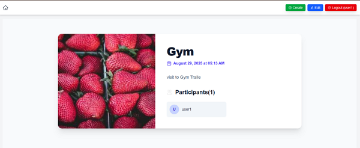

#### [user can't edit page]

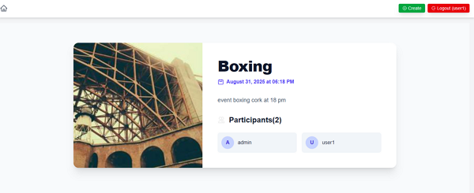

