# React Module 2 SSR React: db Prisma

## Project: Events

| ID | Username | Email           | Role  |
|----|----------|-----------------|-------|
| 2  | user1    | user1@gmail.com | USER  |
| 5  | admin    | admin@gmail.com | ADMIN |
| 6  | user2    | user2@gmail.com | USER  |

#### [home page]

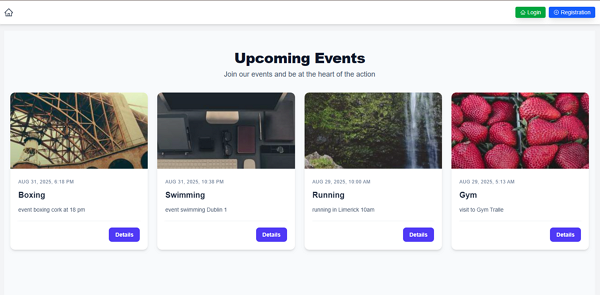

#### [details page]

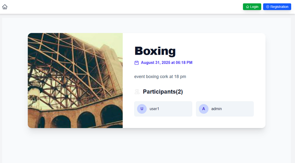

#### [register page]

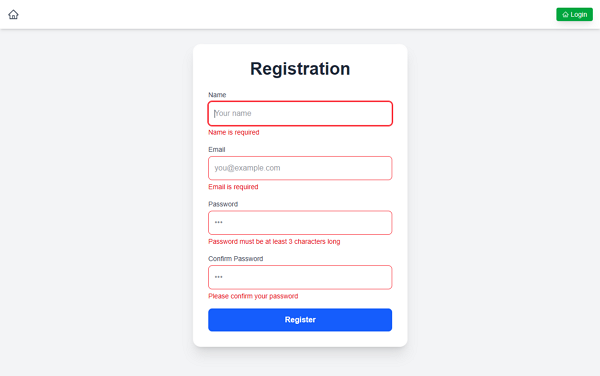

#### [login page]

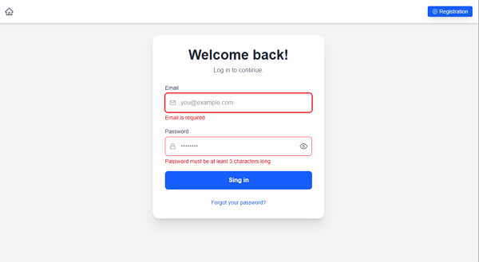

#### [admin home page]


#### [admin details page]

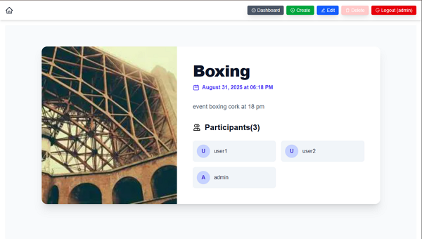

#### [admin modal delete event]

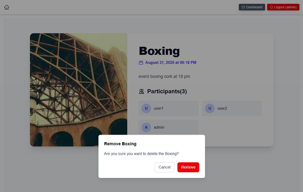

#### [admin create page]

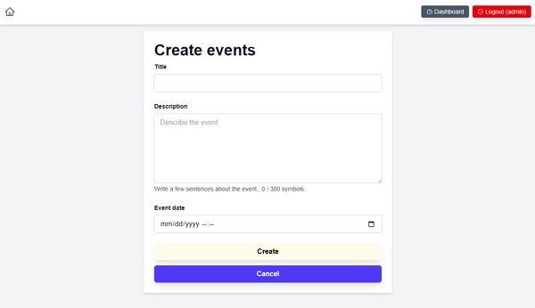

#### [admin edite page]

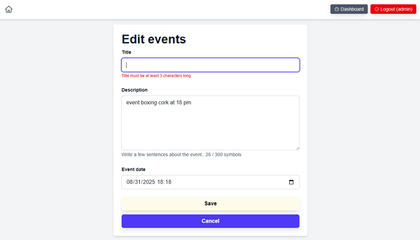

#### [admin dashboard page]

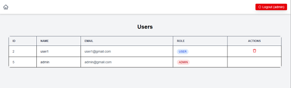

#### [admin modal delete user]

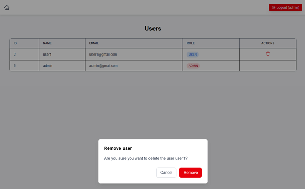

#### [user home page]

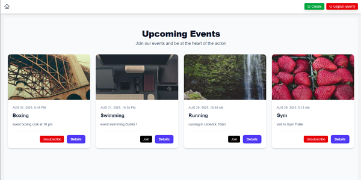

#### [user edit page]

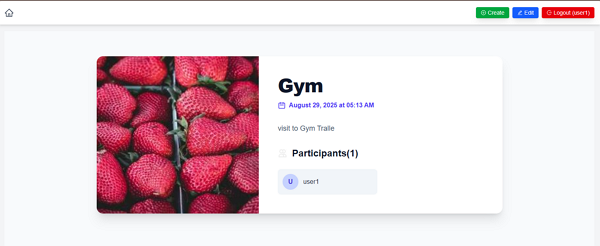

#### [user can't edit page]

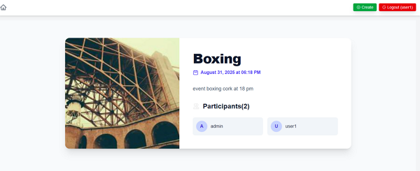

📦 Установка и инициализация проекта
npx create-next-app@latest
npm install --save-dev prisma@latest
npx prisma init

🧹 Форматирование и миграции
npx prisma format
npx prisma migrate dev --name init
npx prisma studio # для просмотра и редактирования данных
npx prisma migrate dev --name fix-email-field
npx prisma migrate reset # сброс и повторная миграция

🔧 Утилиты для разработки
npm install --save-dev tsx@latest
npx prisma generate

```json
{
  "id": 4,
  "name": "User 1",
  "events": [
    {
      "id": 2,
      "eventDate": "2025-08-05T11:11:50.168Z"
    }
  ]
}
```

# Работа с переменными окружения в Next.js

https://chatgpt.com/share/689c72b7-ce8c-8011-9b6f-b8205beb56ac

В Next.js данные автоматически подтягиваются из файлов `.env` в зависимости от режима запуска приложения:

- `.env.development` — для режима `next dev`
- `.env.production` — для режима `next build` и `next start`
- `.env.test` — для тестов

---

## Пример `.env.development`

```env
API_URL=development.api.url.example
```

## Пример `.env.production`

```env
API_URL=production.api.url.example
```

## Использование переменных в коде

В файлах Next.js переменные окружения можно получить через process.env:

```js
export async function getServerSideProps() {
	console.log("process.env", process.env);

	return {
		props: {},
	};
}
```

Пример вывода:

```text
// API_URL: 'development.api.url.example'
// NODE_ENV: 'development'
// process.env содержит множество системных параметров
```

## Альтернативный способ — next.config.js

Можно задать переменные в next.config.js:

```js
module.exports = {
	env: {
		NEXT_PUBLIC_API_URL: process.env.NEXT_PUBLIC_API_URL,
	},
};
```

1. Переменные, заданные в next.config.js, имеют приоритет над .env.
2. Этот способ подходит только для общедоступных переменных.
3. Все переменные из env встраиваются в билд и становятся доступны в браузере, даже если не указан NEXT_PUBLIC_.

## Безопасная работа с .env файлами

Next.js поддерживает создание серверных API-маршрутов, что позволяет безопасно работать с внешними сервисами и скрывать
секретные ключи.
Пример использования API-ключа для получения прогноза погоды с сервиса OpenWeather.

1. Создаём файл .env.development:

```env
OPENWEATHER_API_KEY=123456789abcdef
```

2. Создание API-роута в Next.js
   Файл: app/api/weather/route.js

```js
import { NextResponse } from "next/server";

export async function GET(request) {
	const searchParams = request.nextUrl.searchParams;
	const city = searchParams.get("city");

	if (!city) {
		return NextResponse.json({ error: "Город не указан" }, { status: 400 });
	}

	const apiKey = process.env.OPENWEATHER_API_KEY;
	const apiUrl = `https://api.openweathermap.org/data/2.5/weather?q=${city}&appid=${apiKey}&lang=ru`;

	try {
		const response = await fetch(apiUrl);
		const data = await response.json();

		if (response.ok) {
			return NextResponse.json(data);
		} else {
			return NextResponse.json(
				{ error: data.message },
				{ status: response.status }
			);
		}
	} catch (error) {
		return NextResponse.json({ error: "Ошибка сервера" }, { status: 500 });
	}
}
```

3. Вызов API-роута из React-компонента

```jsx
"use client";

import { useState } from "react";

export default function Home() {
	const [city, setCity] = useState("");
	const [weather, setWeather] = useState(null);
	const [error, setError] = useState("");

	const fetchWeather = async () => {
		setError("");
		setWeather(null);

		try {
			const response = await fetch(`/api/weather?city=${city}`);
			const data = await response.json();

			if (response.ok) {
				setWeather(data);
			} else {
				setError(data.error || "Ошибка при получении данных");
			}
		} catch {
			setError("Ошибка сети");
		}
	};

	return (
		<div>
			<input
				value={city}
				onChange={(e) => setCity(e.target.value)}
				placeholder="Введите город"
			/>
			<button onClick={fetchWeather}>Получить погоду</button>

			{error && <p style={{ color: "red" }}>{error}</p>}
			{weather && (
				<div>
					<h3>Погода в {weather.name}</h3>
					<p>Температура: {Math.round(weather.main.temp - 273.15)}°C</p>
					<p>Описание: {weather.weather[0].description}</p>
				</div>
			)}
		</div>
	);
}
```

```text
Такой подход защищает API-ключ от утечки, так как он остаётся на сервере и никогда не передаётся клиенту.
```

#### Важные замечания по безопасности

Эндпоинт /api/weather остаётся публичным — любой пользователь может отправить запрос.
Для дополнительной защиты можно использовать:

1. CORS — ограничение вызовов только с вашего домена.
2. Аутентификация — проверка токена.
3. Rate limiting — ограничение частоты запросов с одного IP.

```text
Итого: ключ защищён, но доступ к API можно дополнительно ограничить только вашим приложением с помощью вышеописанных методов.
```

